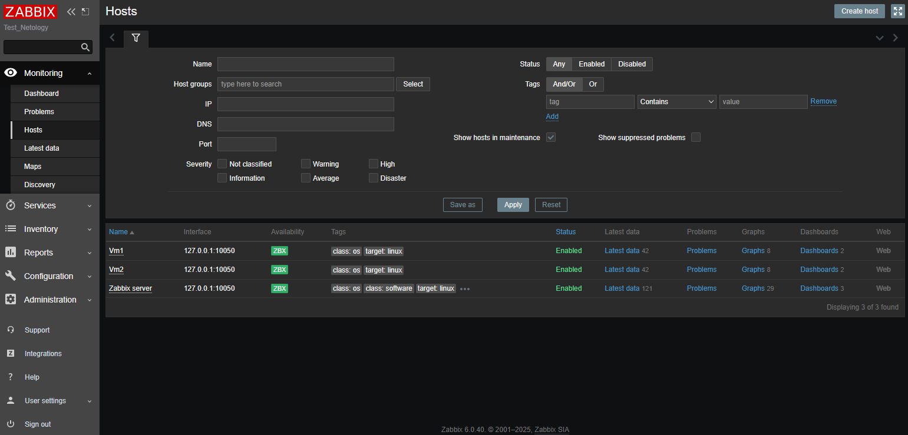
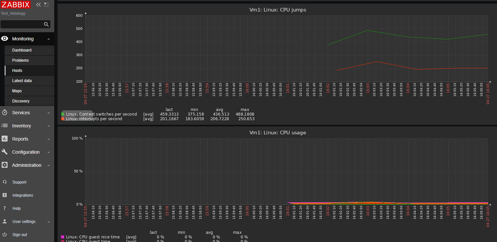
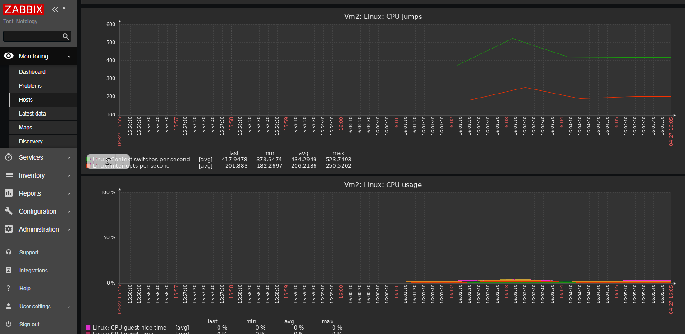

# hw-02.md

## Скриншот админ-панели

**Информация об авторизации в админке:**
- Логин: Admin
- Пароль: zabbix

## Общая доска (Global view)

**Комментарий к общей доске:**
- На общей доске отображается системная информация и статус мониторинга
- Видны различные категории проблем: Disaster, High, Average, Warning, Information
- Отображается количество доступных и недоступных хостов
- Панель предоставляет быстрый обзор всей инфраструктуры

## Подключенные хосты

**Подключенные виртуальные машины:**
- vm1 (127.0.0.1:10050)
- vm2 (127.0.0.1:10050)
- Zabbix server (127.0.0.1:10050)

## Статистика CPU виртуальных машин

### VM1 - Статистика CPU

**Показатели VM1:**
- CPU jumps: отображает количество переключений контекста и прерываний в секунду
- CPU usage: показывает процент использования CPU

### VM2 - Статистика CPU

**Показатели VM2:**
- CPU jumps: отображает количество переключений контекста и прерываний в секунду
- CPU usage: показывает процент использования CPU

*Примечание: После входа в админ-панель вы получите доступ ко всем функциям управления сайтом.*
