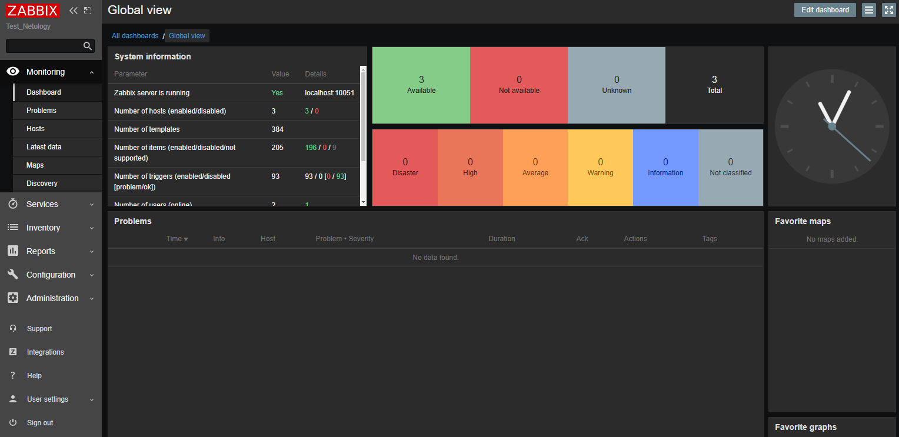
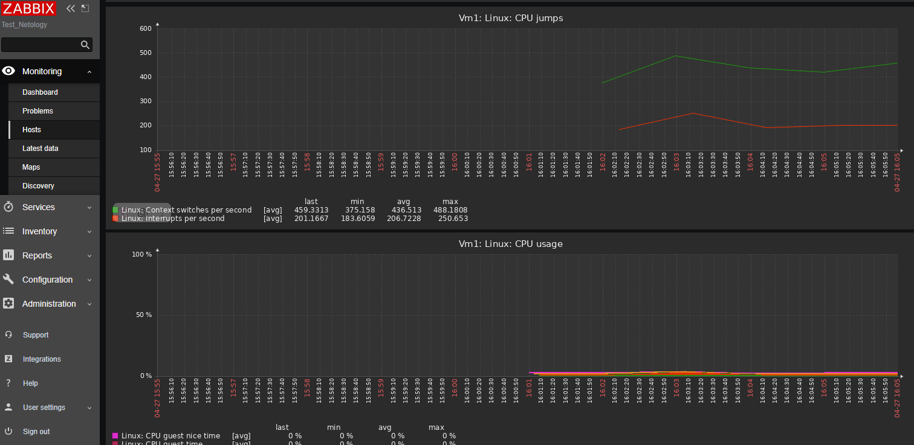
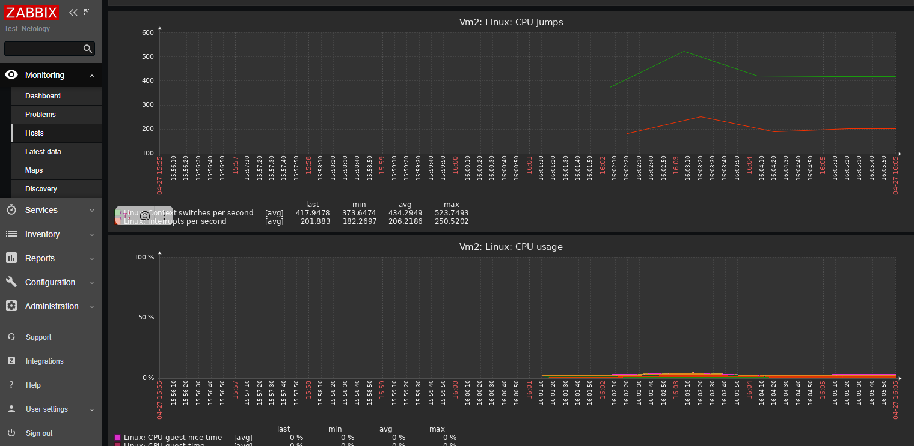

# 📊 hw-02.md: Мониторинг Zabbix

Данный репозиторий содержит отчет о выполнении домашнего задания по настройке системы мониторинга Zabbix.

## 📋 Содержание
- [Скриншот админ-панели](#скриншот-админ-панели)
- [Общая доска (Global view)](#общая-доска-global-view)
- [Подключенные хосты](#подключенные-хосты)
- [Статистика CPU виртуальных машин](#статистика-cpu-виртуальных-машин)

---

## 🔐 Скриншот админ-панели

**Информация об авторизации в админке:**
- **Логин:** Admin
- **Пароль:** zabbix

## 🖥️ Общая доска (Global view)

**Комментарий к общей доске:**
- На общей доске отображается системная информация и статус мониторинга.
- Видны различные категории проблем: *Disaster, High, Average, Warning, Information*.
- Отображается количество доступных и недоступных хостов.
- Панель предоставляет быстрый обзор всей инфраструктуры.

## 🔗 Подключенные хосты

**Подключенные виртуальные машины:**
- `vm1` (127.0.0.1:10050)
- `vm2` (127.0.0.1:10050)
- `Zabbix server` (127.0.0.1:10050)

## 📈 Статистика CPU виртуальных машин

### VM1 - Статистика CPU

**Показатели VM1:**
- **CPU jumps:** отображает количество переключений контекста и прерываний в секунду.
- **CPU usage:** показывает процент использования CPU.

### VM2 - Статистика CPU

**Показатели VM2:**
- **CPU jumps:** отображает количество переключений контекста и прерываний в секунду.
- **CPU usage:** показывает процент использования CPU.

---

*Примечание: После входа в админ-панель вы получите доступ ко всем функциям управления сайтом.*
