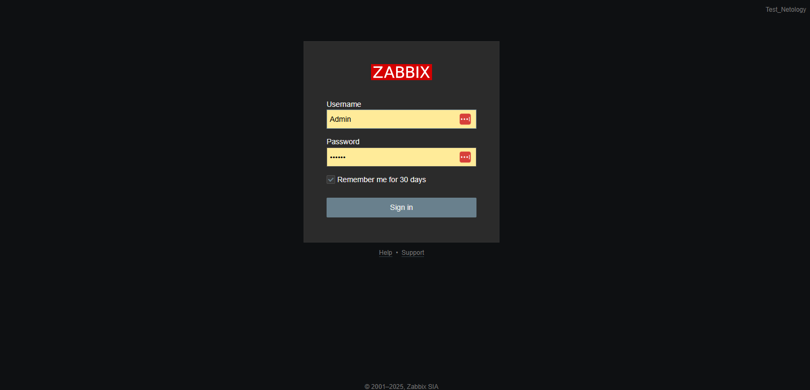

# hw-02.md

## Скриншот админ-панели



**Информация об авторизации в админке:**
- Логин: Admin
- Пароль: zabbix

## Общая доска (Global view)


**Комментарий к общей доске:**
- На общей доске отображается системная информация и статус мониторинга
- Видны различные категории проблем: Disaster, High, Average, Warning, Information
- Отображается количество доступных и недоступных хостов
- Панель предоставляет быстрый обзор всей инфраструктуры

## Подключенные хосты


**Подключенные виртуальные машины:**
- vm1 (127.0.0.1:10050)
- vm2 (127.0.0.1:10050)
- Zabbix server (127.0.0.1:10050)

## Статистика CPU виртуальных машин

### VM1 - Статистика CPU


**Показатели VM1:**
- CPU jumps: отображает количество переключений контекста и прерываний в секунду
- CPU usage: показывает процент использования CPU

### VM2 - Статистика CPU


**Показатели VM2:**
- CPU jumps: отображает количество переключений контекста и прерываний в секунду
- CPU usage: показывает процент использования CPU

*Примечание: После входа в админ-панель вы получите доступ ко всем функциям управления сайтом.*

## Основные Git команды для работы с репозиторием

Для управления версиями и обновления репозитория использовались следующие основные Git команды:

1. **git status** - проверка текущего состояния репозитория и отслеживание изменений в файлах
   ```bash
   git status
   ```

2. **git add** - добавление изменений в индекс (staging area)
   ```bash
   git add README.md                                # добавление конкретного файла
   git add screenshots/conect_2vm.png screenshots/vm1.png screenshots/vm2.png  # добавление нескольких файлов
   ```

3. **git commit** - создание коммита с сохранением изменений в локальном репозитории
   ```bash
   git commit -m "Обновлены пути к скриншотам в README.md"  # создание коммита с сообщением
   ```

4. **git push** - отправка локальных изменений в удаленный репозиторий (GitHub)
   ```bash
   git push  # отправка изменений в удаленный репозиторий
   ```

5. **git diff** - просмотр конкретных изменений в файлах
   ```bash
   git diff README.md  # просмотр изменений в конкретном файле
   ```

6. **git log** - просмотр истории коммитов
   ```bash
   git log --oneline -n 3  # просмотр последних 3 коммитов в сокращенном формате
   ```
